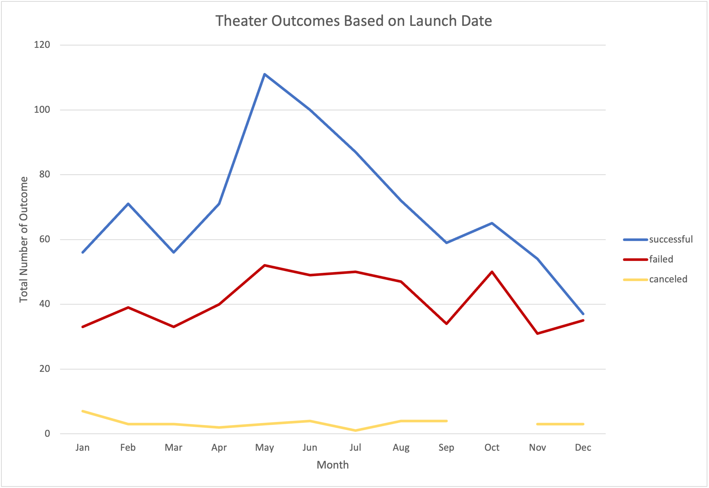
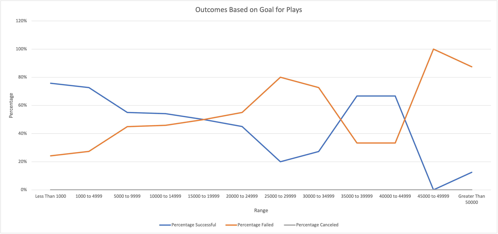

# Kickstarting with Excel

## Overview of Project

In this analysis I delve into several thousand crowdfunding campaigns in several different countries on several different categories starting and ending in different intervals. My data comes from 21 countries collected from 2009 to 2017. With the plethora of data, I am scrutinizing for possible trends in order to see what made certain campaigns successful and certain campaigns unsuccessful in certain months of the years. At the end of this analysis, I provide a conclusion on my findings, challenges, shortcomings and possible improvements regarding the data. 

### Purpose
The core purpose of this analysis is to help my client Louise generate insights on what makes a successful theater crowdfunding campaign for her to successfully crowdfund for her play "Fever". With the best practices of previous crowdfunding campaigns, I will help Louise execute a successful theater crowdfunding campaign.

## Analysis and Challenges

My analysis follows two questions: in my first question I try to understand theater crowdfunding campaigns based on launch date filtered according to months over the years from 2009 to 2014; in my second question I further delve into the parent category of theater data, in which I scrutinize the subcategory of 'plays' according to each campaign' success/failure/cancelation rate in accordance with the projected goal. Although, a more thorough analysis can be conducted, with my analysis I forecast a concise explanation and possible recommendations to build onto this report to attain a better outcome.   

### Analysis of Outcomes Based on Launch Date
In my first question I try to understand in what monthly interval are theater crowdfunding campaigns more successful.  ***Figure 1: Theater Outcomes Based on Launch Date*** 

In the line graph above I filtered my data according to successful, failed and canceled theater crowdfunding campaigns. In total there is 1,369 data points that fall into this part of the analysis. Overall, from March to May the number of successful campaigns is increasing steeply, although the number of successful campaigns are still high after May, there is a steady inclination in the number of successful campaigns until September. The pinnacle of successful campaigns was recorded in May with 111 campaigns, whereas the lowest month of unsuccessful campaigns was recorded in December.  Throughout the months the number of unsuccessful crowdfunding campaigns is stable with an average number of 41 campaigns per month. The highest number of unsuccessful campaigns is recorded in May and October with 50 campaigns in total. Lastly, the number of canceled campaigns is constant throughout the months at less than 10 crowdfunding campaigns per month. 

### Analysis of Outcomes Based on Goals
In my second question I try to understand what goal interval are play crowdfunding campaigns more successful in all 21 countries. I solely focus on the subcategory of plays because of their high success rate in the parent category of theater. ***Figure 2: Outcomes Based on Goals*** 

In the line graph above, I arranged my data according to 12 ranges. The blue line represents successful outcomes, the orange line represents failed outcomes, and the gray line represents canceled outcomes. The 'less than '$1,000' and '$1,000 to $4,999' are ranges where plays recorded a high success rate of about 80%. After these ranges, there is a steady decrease until the '$25,000 to $29,999' range hitting a 20% low, however, it sharply bounces back up to achieve a success rate of about 70% in the ranges for '$35,000 to $39,999' and '$40,000 to $44,999'. Lastly, the success rate plunges to a 0% at the '$45,000 to $49,999' range and then bounces back to a success rate of about 20% in the 'greater than $50,000' range. The highest unsuccessful goal recorded was the '$25,000 to $29,999' and '$45,000 to $49,999' range.  There is no recorded canceled play crowdfunding campaigns from 2009 to 2014 in all 21 countries.  

### Challenges and Difficulties Encountered
Overall, I seamlessly conducted the analysis. However, I can say my biggest challenge was logically understanding the mechanics behind pivot tables, however I overcame this problem by looking it up on Google and revising course material. It is important to be scrupulous in Excel when writing conditional functions in order to get a result. I had a difficulty in realizing what mistake I did when I wrote my COUNTIF function. That is why I believe; it is much beneficial to do peer programming to have another pair of eyes control each other’s work. 
## Results

- What are two conclusions you can draw about the Outcomes based on Launch Date?

Firstly, the data shows that starting the campaign in May is the most effective way to initiate a successful campaign. However, in doing this I went further to see in what years the campaigns in May were successful, in which I found that the 111 campaigns were launched in between the years 2014 - 2016. In a later further analysis, I would want to check what made these campaigns in this time interval a success and what external macro event happened in the countries where the campaigns were funded to make people support the many campaigns. 

Secondly, I can conclude that towards the end of the year, the number of successful campaigns decrease while the number of failed campaigns increase. This may because people generally spend more during spring/ summer months compared to autumn/ winter months, of course this will vary according to country. In a further study, I will want to conduct a study underscoring and understanding people’s attitudes towards crowdfunding to see during what year do they prefer to support funds. 

- What can you conclude about the Outcomes based on Goals?

Albeit there seems to be a correlation between the lower the goal the higher the rate of successful campaigns, painstaking analysis needs to be conducted to not confuse correlation and causation. After the '$25,000 to $29,999' range the higher goals result in relatively higher success rates compared to the goals with low ranges. Even if I can say that goals in between the range 'less than '$1,000' and '$1,000 to $4,999' have higher success rates, a definite correlation stating that the lower the goal the higher the success rate can't be established. In a further study, I would want to explore why the '$35,000 to $39,999' and '$40,000 to $44,999 ranges have a high success rate and why the success rate for the '$45,000 to $49,999' range plunges to zero. 

- What are some limitations of this dataset?

I believe crowdfunding campaigns are more than conducting quantitative analysis because for people this is an act of voluntary giving in something that holds a risk of failing. The data does not give us a sense of understanding of the psychology of why people supported the successful campaigns and didn't bother supporting the unsuccessful campaigns. And was there a significant difference in the teams of successful and unsuccessful campaigns making successful campaigns ace their goals. Secondly, to see whether a correlation does exist, we would need to provide more data that will explain the ups and downs of the relationship on outcomes based on goals. 

- What are some other possible tables and/or graphs that we could create?

I believe to get a clearer idea of the different campaigns in different countries scrutinizing the data individually for each country will give a better idea for Louise. Each country has a different social fabric which results in how people see and feel about supporting risky assets. I would create an outcome based on launch date and outcome based on goals for the country that represents where Louise plans to launch the crowdfunding campaign. I would also want to conduct a yearly analysis on the theater outcomes based on launch date to get a sense of a broader picture of the economy of the countries in that year. I would do this because as I said there is a risk associated for people wanting to support crowdfunding campaigns and if the economy is doing bad people would rather save then spend on risky assets. Lastly, I would go further and specifically analyze and build tables and/ or graphs of plays that fits the blurb of her play, "Fever", to get a sense of what made those plays successful and conduct a comparative analysis with those similar plays that failed.
